# AlertaUTEC - Arquitectura de Solución Completa

## Diagrama de Arquitectura (Flujo Completo)

```mermaid
graph TB
    subgraph "Capa de Presentación"
        WEB[Web App React/Next]
        MOBILE[App Móvil]
        ADMIN[Panel Admin]
    end

    subgraph "Capa de Autenticación"
        APIGW_AUTH[API Gateway HTTP<br/>Auth Endpoints]
        L_AUTH[Lambda Auth Service<br/>register/login]
        L_AUTHORIZER[Lambda Authorizer<br/>JWT Validator]
        DDB_USERS[(DynamoDB<br/>UsersTable)]
        SECRETS[AWS Secrets Manager<br/>JWT Secret Key]
    end

    subgraph "Capa de Gestión de Incidentes"
        APIGW_REST[API Gateway HTTP<br/>REST API]
        L_CREATE[Lambda Create Incident]
        L_UPDATE[Lambda Update Incident]
        L_GET[Lambda Get Incidents]
        DDB_INC[(DynamoDB<br/>Incidents Table<br/>+ Streams)]
        S3[S3 Bucket<br/>Attachments/Evidence]
    end

    subgraph "Capa de Tiempo Real"
        APIGW_WS[API Gateway WebSocket<br/>wss://...]
        L_CONNECT[Lambda $connect]
        L_DISCONNECT[Lambda $disconnect]
        DDB_CONN[(DynamoDB<br/>Connections Table)]
        L_BROADCAST[Lambda Broadcaster<br/>Stream Consumer]
    end

    subgraph "Capa de Notificaciones"
        L_NOTIFIER[Lambda Notifier<br/>Stream Consumer]
        SNS[Amazon SNS Topic<br/>IncidentAlerts]
        EMAIL[Email Autoridades]
        SMS[SMS Autoridades]
    end

    subgraph "Capa de Orquestación (Opcional)"
        EB[EventBridge]
        AIRFLOW[Apache Airflow ECS<br/>DAGs clasificación/reportes]
        SAGEMAKER[SageMaker<br/>ML Models]
    end

    subgraph "Observabilidad"
        CW[CloudWatch Logs]
        XRAY[X-Ray Tracing]
    end

    %% Flujo de Autenticación
    WEB -->|1. POST /auth/register| APIGW_AUTH
    WEB -->|2. POST /auth/login| APIGW_AUTH
    APIGW_AUTH --> L_AUTH
    L_AUTH --> DDB_USERS
    L_AUTH --> SECRETS
    L_AUTH -->|JWT Token| WEB

    %% Flujo de Crear Incidente
    WEB -->|3. POST /incidents<br/>+ JWT Header| APIGW_REST
    APIGW_REST -->|Valida JWT| L_AUTHORIZER
    L_AUTHORIZER --> SECRETS
    L_AUTHORIZER -->|Claims ctx| APIGW_REST
    APIGW_REST --> L_CREATE
    L_CREATE --> DDB_INC
    L_CREATE -->|Upload| S3

    %% Streams dispara eventos
    DDB_INC -->|DynamoDB Streams<br/>INSERT/MODIFY| L_BROADCAST
    DDB_INC -->|DynamoDB Streams<br/>INSERT/MODIFY| L_NOTIFIER

    %% Flujo WebSocket
    WEB -->|4. Connect WebSocket<br/>?sub=user&role=student| APIGW_WS
    APIGW_WS -->|$connect| L_CONNECT
    L_CONNECT --> DDB_CONN
    MOBILE --> APIGW_WS
    ADMIN --> APIGW_WS

    %% Broadcast a clientes
    L_BROADCAST --> DDB_CONN
    L_BROADCAST -->|postToConnection| APIGW_WS
    APIGW_WS -->|IncidentCreated<br/>IncidentStatusChanged| WEB
    APIGW_WS --> MOBILE
    APIGW_WS --> ADMIN

    %% Notificaciones SNS
    L_NOTIFIER -->|Publish| SNS
    SNS --> EMAIL
    SNS --> SMS

    %% Actualizar incidente
    ADMIN -->|5. PATCH /incidents/:id<br/>+ JWT| APIGW_REST
    APIGW_REST --> L_AUTHORIZER
    APIGW_REST --> L_UPDATE
    L_UPDATE --> DDB_INC

    %% Consultar incidentes
    ADMIN -->|6. GET /incidents| APIGW_REST
    APIGW_REST --> L_GET
    L_GET --> DDB_INC

    %% Orquestación (opcional)
    DDB_INC --> EB
    EB --> AIRFLOW
    AIRFLOW --> SAGEMAKER

    %% Desconexión
    WEB -->|Close Connection| APIGW_WS
    APIGW_WS -->|$disconnect| L_DISCONNECT
    L_DISCONNECT --> DDB_CONN

    %% Observabilidad
    L_AUTH -.-> CW
    L_CREATE -.-> CW
    L_BROADCAST -.-> CW
    L_NOTIFIER -.-> CW
    APIGW_REST -.-> XRAY
    L_AUTH -.-> XRAY

    style WEB fill:#e1f5ff
    style APIGW_AUTH fill:#fff4e6
    style APIGW_REST fill:#fff4e6
    style APIGW_WS fill:#e8f5e9
    style DDB_INC fill:#f3e5f5
    style DDB_USERS fill:#f3e5f5
    style DDB_CONN fill:#f3e5f5
    style SNS fill:#fce4ec
    style L_BROADCAST fill:#fff9c4
    style L_NOTIFIER fill:#fff9c4
```



## Secuencia de Llamadas Detallada

### 1️⃣ Registro de Usuario
```
Usuario → API Gateway Auth → Lambda Auth Service
                                    ↓
                              DynamoDB Users (PutItem)
                                    ↓
                              Secrets Manager (GetSecretValue para JWT key)
                                    ↓
                              ← JWT firmado (access + refresh tokens)
```

### 2️⃣ Login de Usuario
```
Usuario → API Gateway Auth → Lambda Auth Service
                                    ↓
                              DynamoDB Users (GetItem)
                                    ↓
                              bcrypt.verify(password)
                                    ↓
                              Secrets Manager (JWT key)
                                    ↓
                              ← JWT firmado con claims {sub, role, email}
```

### 3️⃣ Crear Incidente (Flujo Completo)
```
Usuario con JWT → API Gateway REST → Lambda Authorizer
                                            ↓
                                      Secrets Manager (valida JWT)
                                            ↓
                                      ← Claims context
                                            ↓
                                    Lambda Create Incident
                                            ↓
                                    DynamoDB Incidents (PutItem)
                                            ↓
                                    [DynamoDB Streams detecta INSERT]
                                            ↓
                        ┌───────────────────┴───────────────────┐
                        ↓                                       ↓
                Lambda Broadcaster                      Lambda Notifier
                        ↓                                       ↓
                DynamoDB Connections (Scan)              SNS Topic (Publish)
                        ↓                                       ↓
                API GW WebSocket Management                 Email/SMS
                        ↓
            postToConnection(connectionId, event)
                        ↓
        ┌───────────────┴───────────────┐
        ↓                               ↓
    Cliente Web                    Panel Admin
    (recibe IncidentCreated)       (recibe IncidentCreated)
```

### 4️⃣ Conexión WebSocket
```
Cliente → API Gateway WebSocket ($connect)
                    ↓
            Lambda Connect Handler
                    ↓
    Extrae claims de query params (sub, role)
                    ↓
    DynamoDB Connections (PutItem)
    { pk: "CONN#<connectionId>", 
      sk: "META#",
      userId: "user123",
      role: "student" }
                    ↓
            ← 200 OK (conexión establecida)
```

### 5️⃣ Actualizar Estado de Incidente
```
Admin con JWT → API Gateway REST → Lambda Authorizer → Lambda Update
                                                              ↓
                                            DynamoDB Incidents (UpdateItem)
                                                              ↓
                                            [Streams detecta MODIFY]
                                                              ↓
                                        Lambda Broadcaster dispara
                                                              ↓
                                        Evento "IncidentStatusChanged"
                                                              ↓
                                        Todos los clientes conectados
```

### 6️⃣ Notificación Automática (Urgencia Alta)
```
Lambda Notifier recibe evento de Streams
            ↓
Evalúa: urgencia in ["alta", "crítica"] ?
            ↓ (SI)
SNS Topic Publish
            ↓
    ┌───────┴───────┐
    ↓               ↓
Email Filter    SMS Filter
    ↓               ↓
Autoridades     Autoridades
(inbox)         (teléfono)
```

### 7️⃣ Desconexión WebSocket
```
Cliente cierra → API Gateway WebSocket ($disconnect)
                            ↓
                Lambda Disconnect Handler
                            ↓
        DynamoDB Connections (DeleteItem)
        Key: { pk: "CONN#<id>", sk: "META#" }
```

## Tabla de Responsabilidades

| Componente | Responsabilidad | Llama a | Es llamado por |
|------------|-----------------|---------|----------------|
| **API Gateway Auth** | Endpoint HTTP autenticación | Lambda Auth | Web/Mobile |
| **Lambda Auth Service** | Register/Login, emitir JWT | DynamoDB Users, Secrets Manager | API GW Auth |
| **Lambda Authorizer** | Validar JWT en requests | Secrets Manager | API GW REST |
| **API Gateway REST** | CRUD incidentes (autorizado) | Lambda Authorizer, Lambdas CRUD | Web/Panel Admin |
| **Lambda Create/Update** | Persistir/modificar incidentes | DynamoDB Incidents, S3 | API GW REST |
| **DynamoDB Streams** | Detectar cambios (INSERT/MODIFY) | Lambda Broadcaster, Lambda Notifier | DynamoDB Incidents |
| **Lambda Broadcaster** | Fan-out eventos a WebSocket | DynamoDB Connections, API GW WS Management | DynamoDB Streams |
| **Lambda Notifier** | Enviar alertas urgentes | SNS Topic | DynamoDB Streams |
| **API Gateway WebSocket** | Mantener conexiones persistentes | Lambda Connect/Disconnect | Web/Mobile/Panel |
| **Lambda Connect** | Registrar nueva conexión WS | DynamoDB Connections | API GW WS |
| **Lambda Disconnect** | Limpiar conexión cerrada | DynamoDB Connections | API GW WS |
| **SNS Topic** | Distribuir notificaciones | Email/SMS endpoints | Lambda Notifier |
| **DynamoDB Connections** | Tracking conexiones activas | - | Lambda Connect/Disconnect/Broadcaster |

## Flujos de Datos (Data Flow)

### Datos que fluyen en cada etapa:

1. **Auth Flow**: Email + Password → Hash → JWT (claims: sub, role, email, exp)
2. **Create Incident Flow**: JWT + {titulo, ubicacion, urgencia} → DynamoDB Item → Stream Record
3. **Broadcast Flow**: Stream Record → {type: "IncidentCreated", id, status, urgencia} → WebSocket JSON
4. **Notification Flow**: Stream Record → SNS Message {id, titulo, urgencia, ubicacion} → Email body
5. **WebSocket Connection**: Query params {sub, role} → DynamoDB Item {connectionId, userId, role}

## Patrones de Arquitectura Utilizados

- **Event-Driven**: DynamoDB Streams dispara Lambdas automáticamente
- **Pub/Sub**: SNS distribuye notificaciones a múltiples suscriptores
- **Fan-out**: Un evento de Stream activa múltiples Lambdas (Broadcaster + Notifier)
- **Serverless**: Escalado automático, sin servidores que gestionar
- **JWT Auth**: Token stateless para autorización en API Gateway
- **WebSocket Persistent Connections**: Comunicación bidireccional en tiempo real

## Latencias Esperadas

- Auth (register/login): ~200-500ms
- Create incident: ~150-300ms
- WebSocket broadcast: ~50-200ms
- SNS notification: ~1-5 segundos (email), ~1-3 segundos (SMS)
- DynamoDB read/write: ~10-50ms

## Escalabilidad

- **API Gateway**: 10,000 requests/segundo (límite por defecto)
- **Lambda**: 1,000 ejecuciones concurrentes (límite inicial)
- **DynamoDB**: On-demand scaling ilimitado
- **WebSocket**: 100,000 conexiones concurrentes (límite configurable)
- **SNS**: 30,000 mensajes/segundo
