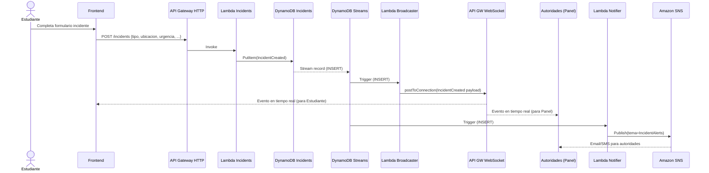
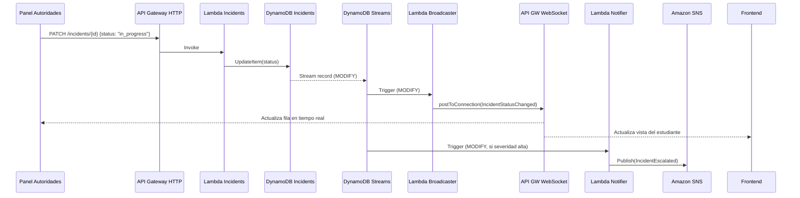

# AlertaUTEC – Flujo en Tiempo Real (WebSocket + Notificaciones)

Este documento describe el flujo end-to-end para: crear incidentes, actualizar estados en tiempo real vía WebSocket de API Gateway, notificar a autoridades por correo/SMS (SNS) y orquestar tareas con Airflow.

## Diagrama de Arquitectura (alto nivel)
```mermaid
flowchart LR
  subgraph Frontend[Frontend (Amplify/React)]
    U1[Usuario Estudiante]
    U2[Panel Autoridades]
  end

  U1 -- HTTP POST /incidents --> HTTP[API Gateway HTTP]
  HTTP --> L1[Lambda Incidents]
  L1 --> DDB[(DynamoDB Incidents)]

  %% Reacciones a cambios
  DDB -- DynamoDB Streams --> BR[Lambda Broadcaster]
  DDB -- DynamoDB Streams --> NT[Lambda Notifier]
  DDB -- DynamoDB Streams --> EB[(Amazon EventBridge)]

  %% Tiempo real
  subgraph WS[API Gateway WebSocket]
    WSC[$connect/$disconnect/subscribe]
  end
  BR --> WS
  WS --> U1
  WS --> U2

  %% Notificaciones
  NT --> SNS[Amazon SNS Topic]
  SNS --> MAIL[Email/SMS Autoridades]

  %% Orquestación opcional
  EB --> MWAA[Apache Airflow (ECS Fargate)]

  %% Conexiones mgmt
  WSC --> CONN[(DynamoDB WebSocketConnections)]
  BR --> CONN
```

## Diagrama de Secuencia – Crear Incidente


## Diagrama de Secuencia – Cambio de Estado


---

## Rutas WebSocket sugeridas
- `$connect`: valida JWT (Authorizer) y persiste `connectionId`, `userId`, `role`, `scope` en `WebSocketConnections` (DynamoDB).
- `$disconnect`: elimina `connectionId`.
- `subscribeIncidents`: (opcional) permite indicar filtros (ej. campus, rol) para segmentar broadcasts.

Tabla `WebSocketConnections` (DynamoDB):
- `pk`: `CONN#<connectionId>`
- `sk`: `USER#<userId>`
- Atributos: `role`, `scopes[]`, `ttl` (opcional), `connectedAt`.

## Eventos/Contratos
- `IncidentCreated`: `{ type: "IncidentCreated", id, reporterId, tipo, ubicacion, urgencia, status, createdAt }`
- `IncidentStatusChanged`: `{ type: "IncidentStatusChanged", id, status, updatedBy, updatedAt }`

Los consumidores (Panel/Frontend) actualizan su estado de UI al recibir estos eventos.

## Estrategia de Broadcast
- Fuente: DynamoDB Streams de `Incidents` (INSERT/MODIFY con filtro por campos relevantes).
- `Lambda Broadcaster`:
  1) Construye el payload del evento.
  2) Obtiene conexiones relevantes desde `WebSocketConnections` (por rol o scope).
  3) Usa `ApiGatewayManagementApi.post_to_connection` para enviar a cada `connectionId`.

## Notificaciones a Autoridades (SNS)
- `Lambda Notifier` se dispara desde Streams.
- Reglas:
  - En `INSERT` si `urgencia in {alta, crítica}`.
  - En `MODIFY` si `status in {in_progress, escalated, resolved}` y política definida.
- Publica en `SNS Topic` con suscripciones Email/SMS para autoridades.

## Punto de Integración con Airflow
- Desde Streams o EventBridge, publicar eventos `IncidentCreated`/`IncidentUpdated` al bus.
- Airflow (en ECS/Fargate) consume vía webhook/EventBridge Rule para:
  - Clasificar incidencias.
  - Asignar responsables.
  - Generar reportes.

---

## Pasos de Implementación (tu scope – tiempo real)
1. WebSocket API (API Gateway)
   - Crear API WebSocket con rutas `$connect`, `$disconnect`, `subscribeIncidents`.
   - Agregar Lambda Authorizer (valida JWT del Auth service).
2. Gestión de Conexiones
   - Lambda `on_connect` y `on_disconnect` con tabla `WebSocketConnections`.
3. Broadcaster por Streams
   - Activar Streams (NEW_AND_OLD_IMAGES) en `Incidents`.
   - Lambda `broadcaster` (trigger de Streams) que envía eventos a clientes.
4. Notificador SNS
   - Lambda `notifier` (trigger de Streams) que publica a `IncidentAlerts` (SNS).
5. Frontend
   - Conectar al WebSocket (firma con JWT), manejar reconexión y backoff.
   - Reducers/Store para `IncidentCreated` y `IncidentStatusChanged`.

## Variables de Entorno (ejemplo Lambdas)
- `WS_CALLBACK_URL`: URL de administración de API Gateway WebSocket.
- `CONNECTIONS_TABLE`: nombre de la tabla `WebSocketConnections`.
- `SNS_TOPIC_ARN`: ARN del tópico de alertas.

---

## Snippets de Referencia (Python)

Handler `$connect` / `$disconnect`:
```python
import os, json, boto3, time
from boto3.dynamodb.conditions import Key

ddb = boto3.resource('dynamodb').Table(os.environ['CONNECTIONS_TABLE'])

def on_connect(event, context):
    request_ctx = event['requestContext']
    connection_id = request_ctx['connectionId']
    claims = request_ctx.get('authorizer', {}).get('jwt', {}).get('claims', {})
    user_id = claims.get('sub', 'anon')
    role = claims.get('role', 'student')
    ddb.put_item(Item={
        'pk': f'CONN#{connection_id}',
        'sk': f'USER#{user_id}',
        'role': role,
        'connectedAt': int(time.time())
    })
    return {"statusCode": 200}

def on_disconnect(event, context):
    connection_id = event['requestContext']['connectionId']
    ddb.delete_item(Key={'pk': f'CONN#{connection_id}', 'sk': f'USER#'})
    return {"statusCode": 200}
```

Broadcaster desde Streams:
```python
import os, json, boto3

apigw = boto3.client('apigatewaymanagementapi', endpoint_url=os.environ['WS_CALLBACK_URL'])
ddb = boto3.resource('dynamodb').Table(os.environ['CONNECTIONS_TABLE'])

INTERESTING_FIELDS = {"status", "urgencia"}

def handler(event, context):
    for rec in event['Records']:
        et = rec['eventName']  # INSERT | MODIFY | REMOVE
        if et not in ("INSERT", "MODIFY"):
            continue
        new = rec['dynamodb'].get('NewImage')
        old = rec['dynamodb'].get('OldImage')
        payload = build_payload(et, new, old)
        if payload is None:
            continue
        # fan-out (ejemplo simple: enviar a todos)
        # en producción: query por role/scope
        items = ddb.scan(ProjectionExpression='pk').get('Items', [])
        for it in items:
            conn_id = it['pk'].split('#', 1)[1]
            try:
                apigw.post_to_connection(ConnectionId=conn_id, Data=json.dumps(payload).encode('utf-8'))
            except apigw.exceptions.GoneException:
                # limpiar conexiones caídas
                ddb.delete_item(Key={'pk': f'CONN#{conn_id}', 'sk': 'USER#'})

def build_payload(event_type, new, old):
    if event_type == 'INSERT':
        return {
            'type': 'IncidentCreated',
            'id': new['id']['S'],
            'status': new['status']['S'],
            'urgencia': new['urgencia']['S'],
            'ubicacion': new['ubicacion']['S'],
        }
    if event_type == 'MODIFY':
        # enviar solo si cambian campos relevantes
        if not old or not any(new.get(f) != old.get(f) for f in INTERESTING_FIELDS):
            return None
        return {
            'type': 'IncidentStatusChanged',
            'id': new['id']['S'],
            'status': new['status']['S'],
        }
    return None
```

Notificador SNS:
```python
import os, json, boto3

sns = boto3.client('sns')
TOPIC_ARN = os.environ['SNS_TOPIC_ARN']

def handler(event, context):
    for rec in event['Records']:
        et = rec['eventName']
        if et not in ("INSERT", "MODIFY"):
            continue
        new = rec['dynamodb'].get('NewImage', {})
        urg = new.get('urgencia', {}).get('S', 'baja')
        status = new.get('status', {}).get('S', 'pending')
        if urg in ('alta','critica') or status in ('in_progress','escalated'):
            msg = {
                'id': new['id']['S'],
                'status': status,
                'urgencia': urg,
                'titulo': new.get('titulo', {}).get('S', ''),
            }
            sns.publish(TopicArn=TOPIC_ARN, Subject='AlertaUTEC Incidente', Message=json.dumps(msg))
```

---

## Checklist de Infraestructura (mínimo viable)
- API Gateway HTTP para `/incidents` (tu compañero Backend).
- DynamoDB `Incidents` con Streams activado.
- API Gateway WebSocket con `$connect`, `$disconnect`, `subscribeIncidents`.
- DynamoDB `WebSocketConnections` para `connectionId` y contexto de usuario.
- Lambda `on_connect`, `on_disconnect`, `broadcaster`, `notifier` (roles IAM con permisos DDB, SNS, execute-api).
- SNS Topic `IncidentAlerts` + suscripciones email/SMS para autoridades.
- Variable `WS_CALLBACK_URL` en `broadcaster` con el endpoint de administración WS.

Con esto puedes iniciar el tiempo real sin bloquear al backend; solo requiere que la tabla `Incidents` exponga Streams. 